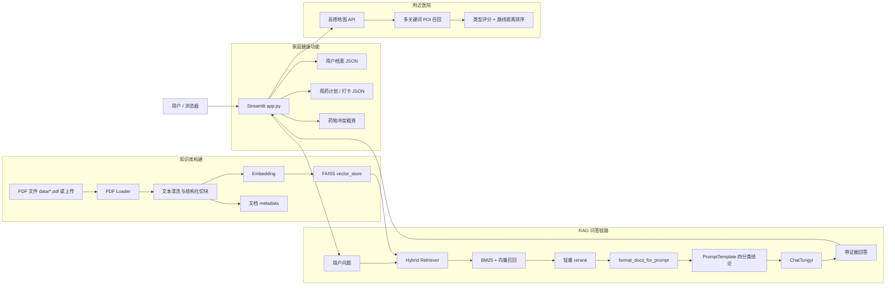

# 家庭医疗知识库 RAG 助手

一个面向家庭健康场景的本地医疗知识库 RAG 应用。项目基于本地 PDF 药品说明书和医学指南构建可检索知识库，支持医疗问答、证据来源引用、家庭健康档案、用药计划、药物冲突粗筛和附近医疗机构推荐。

> 说明：本项目用于学习、演示和本地辅助查询，不构成正式医学诊断，也不能替代医生或执业药师建议。

## 功能概览

- 本地 PDF 知识库构建：支持从 `data/*.pdf` 或 Streamlit 上传 PDF 构建 FAISS 向量索引。
- RAG 医疗问答：基于 LangChain、FAISS、BM25、DashScope 通义模型实现本地证据优先的问答。
- 混合检索与 rerank：结合向量检索和 BM25 关键词检索，适配药名、剂量、禁忌、不良反应等精确查询。
- 证据引用：回答中要求引用文件名、页码和章节，证据不足时明确说明缺少哪类依据。
- 四分类回答：强制模型先输出明确结论，如“可以按说明书使用”“不建议自行使用”“禁止/避免使用”“当前知识库无法判断”。
- 家庭健康档案：支持多家庭成员档案、过敏史、慢病史和当前用药记录。
- 用药计划和打卡：支持记录用药计划、服药时间和每日打卡。
- 药物冲突粗筛：根据本地知识库检索药物相互作用、禁忌和风险关键词。
- 附近医疗机构推荐：接入高德地图 API，多关键词召回医院、卫生院、门诊、诊所、急救中心等，并按类型和路线距离排序。
- 工程可靠性加固：知识库重建采用 staging 校验后替换，失败时保留旧索引；登录密码使用 PBKDF2 并兼容旧 sha256 迁移。

## 技术栈

- Python
- Streamlit
- LangChain
- FAISS
- BM25
- FastEmbed / 本地 Hash Embedding fallback
- DashScope 通义千问
- 高德地图 Web API
- PyMuPDF / PyPDF

## 系统架构



架构图源码见 [docs/architecture.mmd](docs/architecture.mmd)。

## 目录结构

```text
.
├── app.py                    # Streamlit 主应用
├── rag_utils.py              # 文档结构化、混合检索、rerank、证据格式化
├── build_knowledge_base.py   # 从 data/*.pdf 构建本地 FAISS 知识库
├── embedding_provider.py     # FastEmbed / Hash embedding 封装
├── evaluate_rag.py           # 检索评测脚本
├── replay_eval.py            # 回放评测脚本
├── config.py                 # 环境变量和路径配置
├── data/                     # PDF、用户档案、用药记录
├── vector_store/             # FAISS 索引
├── eval_sets/                # 评测集和评测报告
└── docs/                     # 架构图等项目文档
```

## 环境配置

项目当前使用的 Python 环境：

```powershell
D:\ananconda3\envs\medical_agent\python.exe
```

安装依赖：

```powershell
cd D:\medical_agent
D:\ananconda3\envs\medical_agent\python.exe -m pip install -r requirements.txt
```

配置环境变量：

```powershell
copy .env.example .env
```

在 `.env` 中填写：

```text
DASHSCOPE_API_KEY=your-dashscope-api-key
TAVILY_API_KEY=your-tavily-api-key
GAODE_MAP_KEY=your-gaode-map-key
EMBEDDING_PROVIDER=fastembed
EMBEDDING_MODEL=BAAI/bge-small-zh-v1.5
```

## 启动项目

```powershell
cd D:\medical_agent
D:\ananconda3\envs\medical_agent\python.exe -m streamlit run app.py
```

默认访问：

```text
http://localhost:8501
```

如果端口被占用：

```powershell
D:\ananconda3\envs\medical_agent\python.exe -m streamlit run app.py --server.port 8502
```

## 构建知识库

方式一：命令行从 `data/*.pdf` 构建：

```powershell
D:\ananconda3\envs\medical_agent\python.exe build_knowledge_base.py
```

方式二：在 Streamlit 左侧“共享知识库”上传 PDF 并重建索引。

知识库重建采用 staging 目录保存和加载校验，校验成功后再替换旧 `vector_store`，失败时保留旧索引。

## 评测

编译检查：

```powershell
D:\ananconda3\envs\medical_agent\python.exe -m py_compile app.py rag_utils.py
```

FAISS 基础测试：

```powershell
D:\ananconda3\envs\medical_agent\python.exe test_faiss.py
```

检索评测：

```powershell
D:\ananconda3\envs\medical_agent\python.exe evaluate_rag.py --questions eval_sets/blind_questions_2026-05-10.json --report eval_sets/blind_report_tmp.json --top-k 7
```

当前本地验证结果：

```text
py_compile app.py rag_utils.py: 通过
test_faiss.py: 通过，FAISS 1.13.2
evaluate_rag.py: 7/7，整体检索准确率 100.0%
```

> 注意：当前 blind set 样本量较小，7/7 只能说明当前冻结评测集通过，不能代表真实医疗问答全场景准确率。

## 示例问题

建议在 UI 中测试：

- 蒙脱石散怎么吃？
- 来那度胺胶囊孕妇能用吗？
- 盐酸二甲双胍片有哪些不良反应？
- 头孢氨苄和布洛芬能一起吃吗？
- 高血压患者日常饮食要注意什么？

观察点：

- 第一行是否输出四分类结论。
- 是否引用具体来源。
- 剂量、频次、禁忌是否来自本地证据。
- 证据不足时是否说明缺少哪类依据。

## 项目亮点

- 不只是调用 LLM API，而是实现了完整 RAG pipeline。
- 针对医疗场景强化了本地证据优先、引用来源、剂量数字保真和证据不足说明。
- 针对药品说明书类问题引入 BM25 + 向量混合召回，兼顾语义相似和精确词匹配。
- 在工程层面处理了知识库重建失败回滚、密码哈希升级、外部 API 异常处理等可靠性问题。
- 附近医疗机构推荐不只按 POI 距离，而是结合医疗机构类型和驾车路线距离排序。

## 局限性

- 项目用于本地辅助查询，不具备真实医疗诊断能力。
- 当前评测集规模较小，仍需要扩充生成质量评测和人工回放测试。
- 药物冲突检测是基于检索和关键词的粗筛，不是严格药学知识图谱。
- 医院推荐依赖高德地图 API，真实效果需要结合 API key、城市和地址进行人工验证。
- `app.py` 仍较大，后续可拆分为认证、地图、RAG、用药计划和知识库服务等模块。
